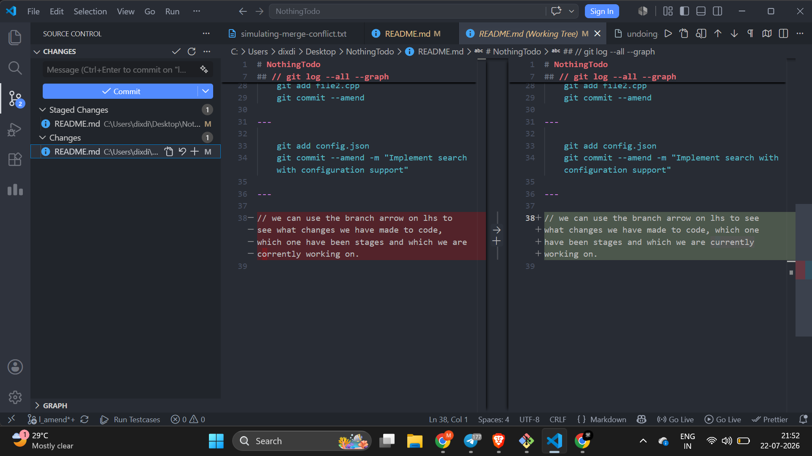

# NothingTodo

// what does -u do ? Instead of typing git push origin main every single time, you can simply type git push or git pull on that branch.

---

## // git log --all --graph

// --amend :

to change the commit message or add some left out change to the latest commit 1. Change the last commit message or Change both the files and the commit message

    git commit -m "Fiex login bug"

    You can correct it with:

    git commit --amend -m "Fix login bug"

---

    git add file1.cpp
    git commit -m "Implement search"

---

    Then you realize you forgot file2.cpp. Stage the forgotten file:

    git add file2.cpp
    git commit --amend

---

    git add config.json
    git commit --amend -m "Implement search with configuration support"

---

// we can use the branch arrow on lhs to see what changes we have made to code, which one have been stages and which we are currently working on.

